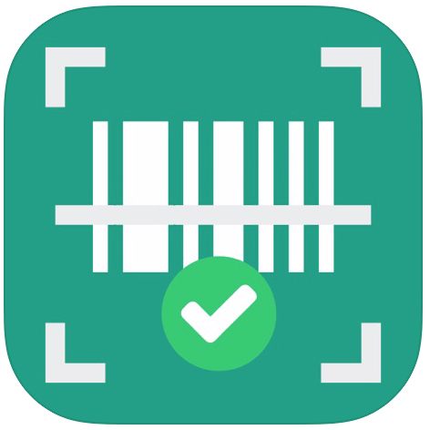

<p align="center">
   
</p>

<p align="center">
   <a href="https://cocoapods.org/pods/AnimatedField">
      
   </a>
   <!--
   <a href="https://github.com/Carthage/Carthage">
      
   </a>
   -->
   <a href="https://cocoapods.org/pods/AnimatedField">
      
   </a>
   <a href="https://developer.apple.com/swift/">
      
   </a>
   <a href="https://cocoapods.org/pods/AnimatedField">
      
   </a>
   <!--
   <a href="https://alberdev.github.io/AnimatedField">
      
   </a>
   -->
   <a href="https://twitter.com/alberdev/">
      
   </a>
   
</p>

<br/>

<p align="center">
   Use <b>AnimatedField</b> as an iOS UITextField/UITextView component. You can check fields with your custom regular expressions or use default ones ordered by types (email, username, password, url, price...). Also can check the field while user is typing in a dynamic way. Limit the text lenght and format fields in your way. Replace your old and bored textfields and textviews with these fancy animated fields. You only need to follow some simple steps to implement it. AnimatedField is customizable and easy to use.
</p>

<br/>

<p align="center" >

</p>

# AnimatedField

- [x] Awesome animations on begin editing field
- [x] Totally customizable
- [x] Check & filter with regular expressions
- [x] Limit text length
- [x] Easy usage
- [x] Supports iOS, developed in Swift 5

## Table of Contents

- [Installation](#installation)
- [Usage](#usage)
  - [UIView in your xib / storyboard](#uiviewinyourxib/storyboard)
  - [Format](#format)
  - [Other field properties](#otherfieldproperties)
  - [DataSource](#datasource)
  - [Delegates](#delegates)
  - [Extra](#extra)
- [Field Types](#fieldtypes)
	- [Email](#email)
	- [Username](#username)
	- [Password](#password)
	- [Price](#price)
	- [Url](#url)
	- [Date picker](#datepicker)
	- [Number picker](#numberpicker)
	- [Multiline](#multiline)
- [Apps using AnimatedField](#apps-using-animatedfield)
- [Author](#author)
- [Contributing](#contributing)
- [License](#license)


## Installation

AnimatedField is available through [CocoaPods](https://cocoapods.org). To install
it, simply add the following line to your Podfile and run `pod install`:

```ruby
pod 'AnimatedField'
```

Then you can import it when you need

```swift
import AnimatedField
```

## Usage

In the example you will see some animated fields that can be used in your project. Once you've installed the pod, follow next steps. It's really simple:

### UIView in your xib / storyboard

Add a `UIView` in the xib where you want to place Animated Field. Then you have to input the class name in the view, you can change this in the identity inspector of the interface builder. Remember to input `AnimatedField` in both (Class & Module)


Then, connect the IBOutlet in your UIViewController

```swift
@IBOutlet weak var animatedField: AnimatedField!
```

### Format

You can format `AnimatedField` with your own parameters. Use it in all fields to get the same style. See default values:
 
```swift
var format = AnimatedFieldFormat()

/// Title always visible
format.titleAlwaysVisible = false

/// Font for title label
format.titleFont = UIFont.systemFont(ofSize: 13, weight: .regular)
    
/// Font for text field
format.textFont = UIFont.systemFont(ofSize: 16, weight: .regular)
    
/// Font for counter
format.counterFont = UIFont.systemFont(ofSize: 13, weight: .regular)
    
/// Line color
format.lineColor = UIColor.lightGray
    
/// Title label text color
format.titleColor = UIColor.lightGray
    
/// TextField text color
format.textColor = UIColor.darkGray
    
/// Counter text color
format.counterColor = UIColor.darkGray
    
/// Enable alert
format.alertEnabled = true

/// Font for alert label    
format.alertFont = UIFont.systemFont(ofSize: 13, weight: .regular)

/// Alert status color
format.alertColor = UIColor.red
    
/// Colored alert field text
format.alertFieldActive = true
    
/// Colored alert line
format.alertLineActive = true
    
/// Colored alert title
format. alertTitleActive = true

/// Alert position
format.alertPosition = .top
    
/// Secure icon image (On status)
format.visibleOnImage = IconsLibrary.imageOfEye(color: .red)
    
/// Secure icon image (Off status)
format.visibleOffImage = IconsLibrary.imageOfEyeoff(color: .red)
    
/// Enable counter label
format.counterEnabled = false
    
/// Set count down if counter is enabled
format.countDown = false

/// Enable counter animation on change
format.counterAnimation = false
    
/// Highlight color when becomes active
format.highlightColor: UIColor? = UIColor(displayP3Red: 0, green: 139/255, blue: 96/255, alpha: 1.0)

/// Secure image (nil for default eye image)
format.secureImage: UIImage? = nil
```

Is important to finally assign format to `AnimatedField`

```swift
animatedField.format = format
```

### Other field properties

There are other some animated field properties you can use in your implementation:

```swift
/// Object that configure `AnimatedField` view. You can setup `AnimatedField` with
/// your own parameters. See also `AnimatedFieldFormat` implementation.
animatedField.format = AnimatedFieldFormat()

/// Field type (default values)
animatedField.type = AnimatedFieldType.none

/// Field text
animatedField.text = "" 

/// Placeholder
animatedField.placeholder = "" 

/// Attributed Placeholder
animatedField.attributedPlaceholder = NSAttributedString(string: "Placeholder", 
                                                         attributes:[.foregroundColor: UIColor.white])

/// Uppercased field format
animatedField.uppercased = false
    
/// Lowercased field format
animatedField.lowercased = false
    
/// Keyboard type
animatedFieldkeyboardType = UIKeyboardType.alphabet 
    
/// Secure field (dot format)
animatedField.isSecure = false
    
/// Show visible button to make field unsecure
animatedField.showVisibleButton = false

/// Result of regular expression validation
let isValid = animatedField.isValid
```

### Implement datasource and delegate

The first way to customize this `AnimatedField` is implementing delegate and datasource methods. These methods handle the most common use cases. Both of them are optional. 

```swift
animatedField.dataSource = self
animatedField.delegate = self
```

### DataSource

Is used to provide data for the field view. The data source must adopt the `AnimatedFieldDataSource` protocol

```swift
// Returns boolean to check if field can be changed. This will override custom implementation.
func animatedField(_ animatedField: AnimatedField, shouldChangeCharactersIn range: NSRange, replacementString string: String) -> Bool? 

// Returns boolean to check if field can return
func animatedFieldShouldReturn(_ animatedField: AnimatedField) -> Bool 

// Needed for limit characters when user fills the field. Returns characters limit
func animatedFieldLimit(_ animatedField: AnimatedField) -> Int?

// Needed for validation when user is filling the field. Returns regular expression to filter characters when user is typing
func animatedFieldTypingMatches(_ animatedField: AnimatedField) -> String? 

// Needed for validation when user ends editing field. Returns regular expression to filter field when user ends editing
func animatedFieldValidationMatches(_ animatedField: AnimatedField) -> String? 

// Returns alert message when validation fails
func animatedFieldValidationError(_ animatedField: AnimatedField) -> String?

// Returns alert message when price exceeded limits (only for price type)
func animatedFieldPriceExceededError(_ animatedField: AnimatedField) -> String? 
```

### Delegates

In order to add more functionality in your app, you must implement `AnimatedFieldDelegate `. Is the responsible for managing selection behavior and interactions with fields.

```swift
// Called when text field begin editing 
func animatedFieldDidBeginEditing(_ animatedField: AnimatedField)

// Called when text field end editing
func animatedFieldDidEndEditing(_ animatedField: AnimatedField)

// Called when field (multiline) is resized
func animatedField(_ animatedField: AnimatedField, didResizeHeight height: CGFloat)

// Called when secure button is pressed. 
// Example: Use it if you like to secure/unsecure other field when this is secured/unsecured (like repeat password field)
func animatedField(_ animatedField: AnimatedField, didSecureText secure: Bool)

// Called when picker value is changed
func animatedField(_ animatedField: AnimatedField, didChangePickerValue value: String)

// Called when alert message is shown. 
// Example: If you have disabled alert messages in field and want to show other kind of message in other view. This will use your own alert messages if you implemented datasource method or default ones if you used default types.
func animatedField(_ animatedField: AnimatedField, didShowAlertMessage text: String)

// Called when text field changed
func animatedFieldDidChange(_ animatedField: AnimatedField)
```

### Extra

You can also use next methods for restarting field, showing / hidding alert and secure / unsecure fields.

```swift
// Restart field (empty field)
func restart()

// Show alert message
func showAlert(_ message: String?)

// Hide alert message
func hideAlert()

// Secure / unsecure field with dots (no visible)
func secureField(_ secure: Bool)
```

## Field Types

### Email

This type will show `.emailAddress` keyboard

```swift
AnimatedFieldType.email
```
>Typing regular expression: "[A-Z0-9a-z@_\\.]" 

>Validation regular expression: "[A-Z0-9a-z._%+-]+@[A-Za-z0-9.-]+\\.[A-Za-z]{2,4}"

### Username

Fill it with `min` & `max` limits for regular expression validation when user ends editing.

```swift
AnimatedFieldType.username(Int, Int)
```

>Typing regular expression: "[A-Za-z0-9_.]"

>Validation regular expression: "[A-Za-z0-9_.]{\(min),\(max)}"

### Password

Fill it with `min` & `max` limits for regular expression validation when user ends editing.

```swift
AnimatedFieldType.password(Int, Int)
```

>Typing regular expression: ".*" 

>Validation regular expression: ".{\(min),\(max)}"

### Price

Fill it with `max price` & `max decimals`. First, will limit result number. `max decimals` will limit decimals. This type will show `.decimalPad` keyboard.

```swift
AnimatedFieldType.price(Double, Int)
```
>Typing regular expression: "[0-9\(decimal)]"  

>Validation regular expression: "^(?=.\*[1-9])([1-9]\\d*(?:\(decimal)\\d{1,\(max decimals)})?|(?:0\(decimal)\\d{1,\(max decimals)}))$"

- `decimal` depends on locale decimal separator

### Url

This type will show `.URL` keyboard.

```swift
AnimatedFieldType.url
```
>Typing regular expression: ".*" 

>Validation regular expression: "https?:\\/\\/(?:www\\.|(?!www))[a-zA-Z0-9][a-zA-Z0-9-]+[a-zA-Z0-9]\\.[^\\s]{2,}|www\\.[a-zA-Z0-9][a-zA-Z0-9-]+[a-zA-Z0-9]\\.[^\\s]{2,}|https?:\\/\\/(?:www\\.|(?!www))[a-zA-Z0-9]+\\.[^\\s]{2,}|www\\.[a-zA-Z0-9]+\\.[^\\s]{2,}"

### Date picker

This type will show date picker view. Fill it with  `mode`, `default date`, `min date`, `max date`, `done label text`, `date format` (Example: "dd / MM / yyyy").

```swift
AnimatedFieldType.datepicker(UIDatePicker.Mode?, Date?, Date?, Date?, String?, String?)
```
>Typing regular expression: ".*" 

>Validation regular expression: ".*" 

### Number picker

This type will show number picker view. Fill it with `default number`, `min number`, `max number`, `done label text`

```swift
AnimatedFieldType.numberpicker(Int, Int, Int, String?)
```

>Typing regular expression: ".*" 

>Validation regular expression: ".*" 

### Multiline

This type will use multiline text and will resize dynamically when user fills the field. When user completes a new line delegate method `didResizeHeight` is called with updated field height. Use this to offset your scroll view.

```swift
AnimatedFieldType.multiline
```

>Typing regular expression: ".*" 

>Validation regular expression: ".*" 

## Apps using AnimatedField

If you use `AnimatedField` I'd love to hear about it and feature your app here!

 [FashTime](https://itunes.apple.com/app/fashtime-the-new-way/id1126538070?mt=8)

 [Check In Event Manager](https://itunes.apple.com/us/app/check-in-event-manager/id1430740368?ls=1&mt=8)

## Author

Alberto Aznar, info@alberdev.com

## Contributing

Feel free to collaborate with ideas 💭, issues ⁉️ and/or pull requests 🔃.

1. Fork it!
2. Create your feature branch: `git checkout -b my-new-feature`
3. Commit your changes: `git commit -am 'Add some feature'`
4. Push to the branch: `git push origin my-new-feature`
5. Submit a pull request :D

## License

AnimatedField is available under the MIT license. See the LICENSE file for more info.

## Libraries by @alberdev

<a href="https://github.com/alberdev/AnimatedField"></a>
<a href="https://github.com/alberdev/ContentLoader"></a>
<a href="https://github.com/alberdev/CiaoTransitions"></a>
<a href="https://github.com/alberdev/DateScrollPicker"></a>
<a href="https://github.com/alberdev/EmptyStateKit"></a>
<a href="https://github.com/alberdev/GridTimerView"></a>
<a href="https://github.com/alberdev/PaintCodeKit"></a>
